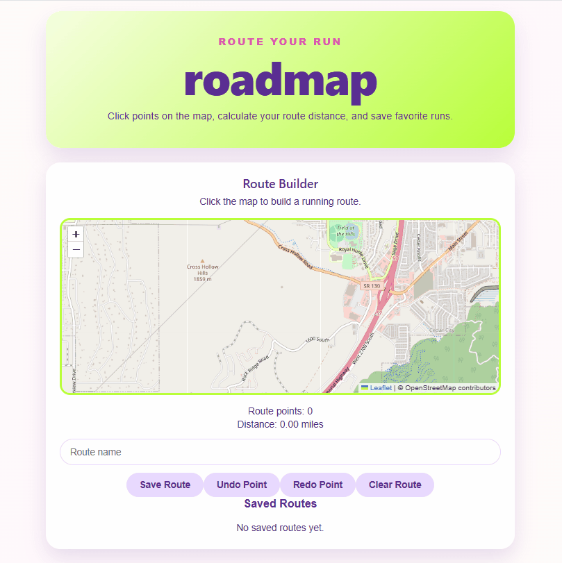

# roadmap

roadmap is a personal project that helps runners plan routes by clicking points on an interactive map. As you build a route, the app calculates the total distance, lets you undo or redo points, and allows you to save named routes for later.
As a long-distance runner, being able to plan routes ahead of time is important to me, so I built roadmap to simplify the planning process.

## Demo



## Features

- Interactive map built with OpenStreetMap
- Click to place route markers
- Automatic route distance calculation
- Undo and redo route points
- Save and reload routes

## Built Using

- React
- TypeScript
- Vite
- React Leaflet
- OpenStreetMap
- CSS

## Running Locally

```bash
git clone https://github.com/rebekahjensen/roadmap.git
cd roadmap/frontend
npm install
npm run dev
```

Then open the local URL shown in the terminal (usually `http://localhost:5173`).

## Future Improvements

Some features I'd like to add:

- Routes that follow roads and trails instead of straight lines
- Delete saved routes
- Store routes using local storage or a database
- GPX export
- Elevation gain calculations
- Mobile-friendly layout

## What I Learned

Building roadmap gave me hands-on experience with React components, TypeScript, state management, event handling, and interactive mapping using React Leaflet.

---

Built by **Rebekah Jensen**
